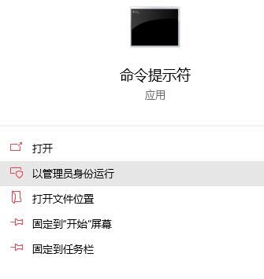
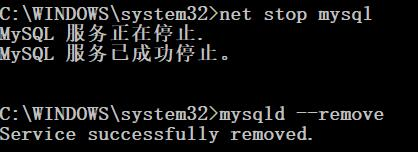
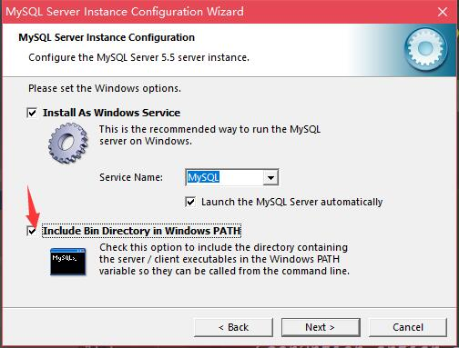
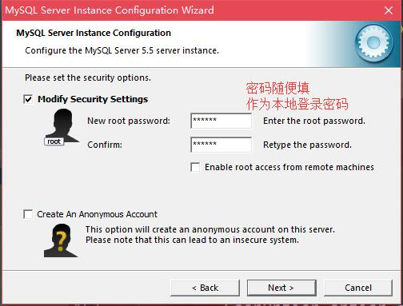
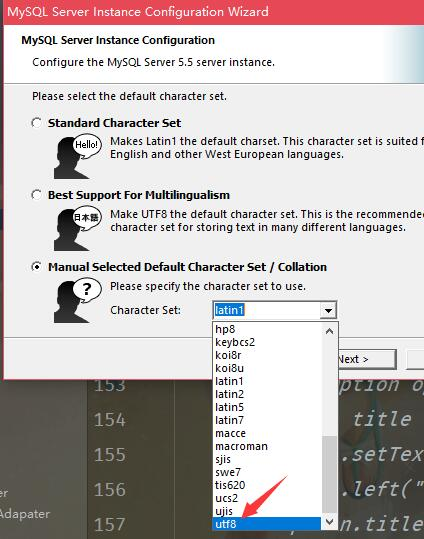
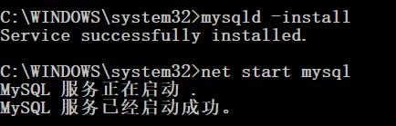
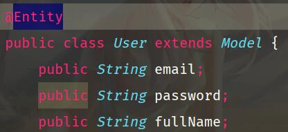
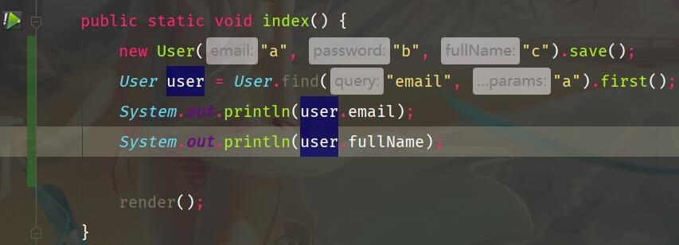
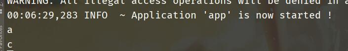

### 因为playframework版本太低卸载mysql8

首先有一件很悲伤的消息，下面这个版本

，因为play版本过低，无法完全兼容，需要降级到mysql5的版本，如果已经安装，那么可以以**管理员启动**命令行

**然后先输入(前提是已经配置过mysql到环境变量 否则请到mysql文件夹中再执行)**

**`net stop mysql`**

**`mysqld --remove`**

 之后整个删除整个`mysql-8.0.12-winx64`版本

### 然后安装MySQL5.7版本

**基本是一路next就可以了**

下面几项注意下

这里选添加到环境变量

设定登录密码

这里务必选择utf8编码

大概就是这些，最后一路next到底就行了，经过漫长的等待，可能会让你重启，重启就可以了

重启之后再以管理员打开命令提示行，执行下面两行语句

`mysqld -install`

`net start mysql`

此时，便可以输入`mysql -u root`进入数据库了

不过这个开始时没有密码的，你需要输入以下两行更新密码

**`set password for 'root'@'localhost'=password('123456');`注：password()里面的就是你设定的密码**

**`flush privileges;`这一步是更新权限**

好了 这样你的数据库便配置完成了

此时回到play你新建的app中在application.conf中

随后编写测试程序

运行app，访问网址后，看到有正常输出

且数据库中有东西

那么则说明配置成功了。

